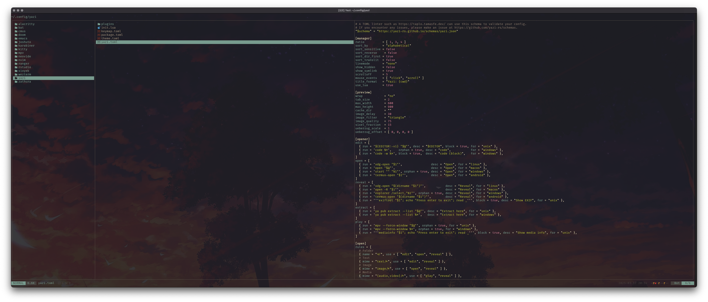

# bat.yazi

Plugin for `Yazi` to preview all supported files via `Bat`.

## Preview




## Installation

```sh
$> ya pack -a knightgu/bat-preview
```

## Configuration

Edit `~/.config/yazi/yazi.toml` and add `bat` as the previewer for the file types of your choice.

```toml
[plugin]
prepend_previewers = [
    { name = "*.csv", run = "bat-preview" },
    { name = "*.md",  run = "bat-preview" }
]

previewers = [
	{ name = "*/", run = "folder", sync = true },
	{ mime = "text/*",                 run = "bat-preview" },
	{ mime = "*/xml",                  run = "bat-preview" },
	{ mime = "*/cs",                   run = "bat-preview" },
	{ mime = "*/javascript",           run = "bat-preview" },
	{ mime = "*/x-wine-extension-ini", run = "bat-preview" },
]
```


## References

* [Yazi - A fast terminal file manager](https://yazi-rs.github.io)
* [Bat - A cat(1) clone with wings](https://github.com/sharkdp/bat)
